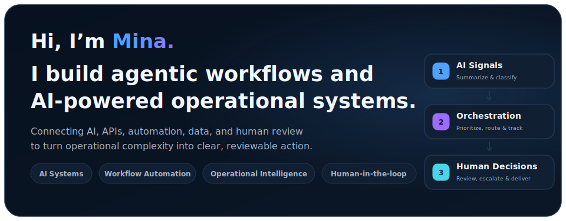

  <picture>
    <source
      media="(prefers-color-scheme: dark)"
      srcset="./assets/intro_dark.svg"
    >
    <source
      media="(prefers-color-scheme: light)"
      srcset="./assets/intro_light.svg"
    >
    
  </picture>

## Focus Areas & Selected Projects

  <picture>
    <source
      media="(prefers-color-scheme: dark)"
      srcset="./assets/work_dashboard_dark.svg?v=1"
    >
    <source
      media="(prefers-color-scheme: light)"
      srcset="./assets/work_dashboard_light.svg?v=1"
    >
    
  </picture>

  <strong>Focus Areas:</strong>
  <a href="https://github.com/Mina314?tab=repositories">Agentic Workflows</a>
  ·
  <a href="https://github.com/Mina314?tab=repositories">Automation Systems</a>
  ·
  <a href="https://www.datascienceportfol.io/mina">Operational Intelligence</a>

  <strong>Projects:</strong>
  <a href="https://github.com/Mina314/Mina314">GitHub Portfolio Intelligence</a>
  ·
  <a href="https://github.com/Mina314?tab=repositories">Agentic Issue Triage</a>
  ·
  <a href="https://github.com/Mina314?tab=repositories">Workflow Patterns</a>

## Portfolio Insights

  <picture>
    <source
      media="(prefers-color-scheme: dark)"
      srcset="./assets/portfolio_insights_dark.svg?v=1"
    >
    <source
      media="(prefers-color-scheme: light)"
      srcset="./assets/portfolio_insights_light.svg?v=1"
    >
    
  </picture>

## Recent Activity

  <picture>
    <source
      media="(prefers-color-scheme: dark)"
      srcset="./assets/activity_dark.svg?v=4"
    >
    <source
      media="(prefers-color-scheme: light)"
      srcset="./assets/activity_light.svg?v=4"
    >
    
  </picture>

Repository insights and activity are refreshed automatically with GitHub Actions.

  

`Python` · `SQL` · `JavaScript` · `GitHub API` · `Jira API` · `Slack` · `n8n` · `Google Apps Script` · `PostgreSQL` · `Airflow` · `Grafana`

---

[LinkedIn](https://www.linkedin.com/in/mina-liu-114200/) ·
[Data Portfolio](https://www.datascienceportfol.io/mina) ·
[Email](mailto:minazliu@gmail.com)
