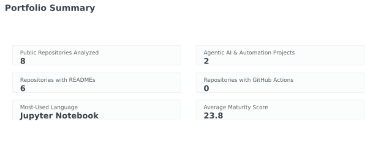
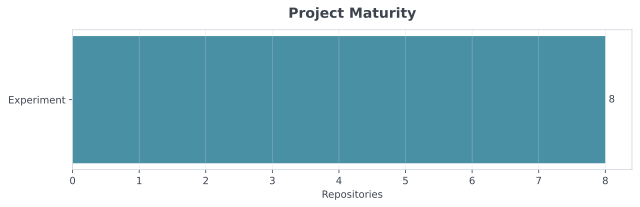
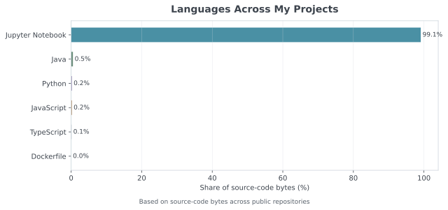

# Hi, I'm Mina 👋

### Senior Technical Program Manager building agentic AI workflows, internal tools, and operational intelligence systems

I work at the intersection of **technical program management**, **agentic AI workflows**, **workflow automation**, **developer productivity**, **data systems**, and **operational intelligence**.

My focus is turning ambiguous, repetitive, and high-stakes processes into scalable systems—combining APIs, AI-assisted classification, workflow orchestration, human-in-the-loop review, risk scoring, owner routing, SLA tracking, dashboards, and alerts with clear escalation paths.

I partner closely with engineering, infrastructure, and program leadership to reduce operational drag, improve signal quality, and make execution visible before it becomes a crisis.

---

## What I Build

### Agentic Workflow Systems

Systems that combine LLM-assisted reasoning with structured workflows—routing work to the right owners, embedding human review at critical decision points, and maintaining audit trails across multi-step processes.

### Operational Intelligence

Dashboards, metrics pipelines, and alerting that surface execution risk early—connecting backlog health, incident patterns, pipeline reliability, and team-level trends into actionable views for program and engineering leaders.

### Developer and Program Automation

Internal tools and integrations that eliminate manual coordination—connecting Jira, Slack, GitHub, and data sources through APIs, Apps Script, and orchestration platforms to keep programs moving without constant status chasing.

### Technical Program Systems

End-to-end program infrastructure: SLA tracking, escalation workflows, cross-team dependency visibility, and reporting frameworks that scale across many engineering teams without adding process overhead.

---

## Selected Experience

- Reduced a high-priority engineering backlog by **62%** through workflow automation and AI-assisted triage
- Improved **P0 response performance by 3x** with structured escalation and owner-routing systems
- Built workflows supporting approximately **15 engineering teams** across infrastructure and platform programs
- Surfaced more than **240 high-priority execution risks** before they impacted delivery timelines
- Supported approximately **800 pipelines** and **28,000 daily CI jobs** with operational intelligence tooling
- Reduced unknown infrastructure root-cause classifications from approximately **54–60% to 8%** through classification workflows and data enrichment
- Supported infrastructure workflows across **more than 10 teams** with shared automation and reporting systems

---

## Portfolio Analytics

  

  
  

  

> These analytics are generated from my public repositories using the GitHub API and refreshed automatically with GitHub Actions.

---

## Tools

**Languages & Scripting**
Python · SQL · JavaScript · Google Apps Script

**Data & Business Intelligence**
Pandas · PostgreSQL · Airflow · Superset · Looker Studio · Tableau · Grafana · Prometheus

**Integrations & Automation**
GitHub API · Jira API · Slack integrations · n8n · GitHub Actions

---

## Current Focus

- Practical agentic workflows with human-in-the-loop guardrails
- Engineering risk triage and AI-assisted classification
- Workflow orchestration across tools and teams
- Operational intelligence and execution visibility
- Developer productivity through internal tooling
- AI-assisted internal tools that reduce coordination overhead

---

## Connect

- LinkedIn: https://www.linkedin.com/in/mina-liu-114200/
- Email: minazliu@gmail.com
