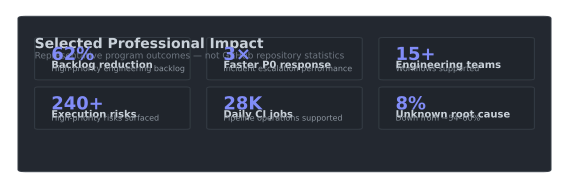
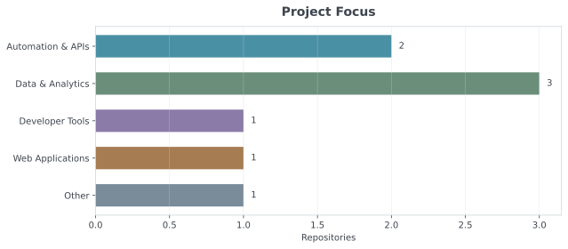
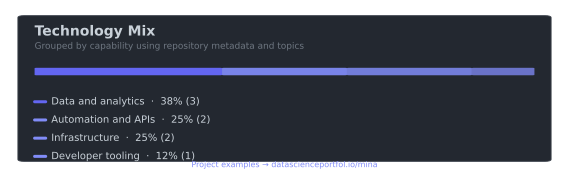

# Hi, I'm Mina 👋

### Technical Program Manager building agentic workflows and AI-powered operational systems

I design workflows that connect **AI, APIs, automation, data, and human review** to help engineering teams move faster and make better decisions.

[LinkedIn](https://www.linkedin.com/in/mina-liu-114200/) · [Email](mailto:minazliu@gmail.com)

---

## Impact

  

---

## What I Build

<table>
<tr>
<td width="33%" valign="top">

### 🤖 Agentic Workflows

AI-assisted triage, classification, scoring, routing, and human approval.

</td>
<td width="33%" valign="top">

### ⚡ Automation Systems

GitHub, Jira, Slack, APIs, n8n, and Apps Script integrations.

</td>
<td width="33%" valign="top">

### 📊 Operational Intelligence

Dashboards and signals for risk, ownership, SLAs, incidents, and execution health.

</td>
</tr>
</table>

---

## Featured Projects

Examples from my [data & analytics portfolio](https://www.datascienceportfol.io/mina):

### [Uber Data Engineering](https://www.datascienceportfol.io/mina)

End-to-end ETL with Python, Google Cloud, Mage.ai, BigQuery, and Looker for scalable data integration.

`Python` `SQL` `Google Cloud` `BigQuery` `Looker`

### [Real-time IoT Data Processing & Analytics](https://www.datascienceportfol.io/mina)

Spark Streaming and Kafka pipeline for real-time operational data processing on AWS.

`Python` `Apache Spark` `Kafka` `AWS`

### [Interactive Analytics Dashboards](https://www.datascienceportfol.io/mina)

Tableau dashboards for jobs, healthcare, and operational metrics with filtering and drill-down.

`Tableau` `SQL` `PostgreSQL` `Data Visualization`

---

## Portfolio

  
  

Automatically generated from my public repositories using the GitHub API and GitHub Actions. · [View project examples →](https://www.datascienceportfol.io/mina)

---

## Toolkit

  
  
  
  
  
  
  
  

